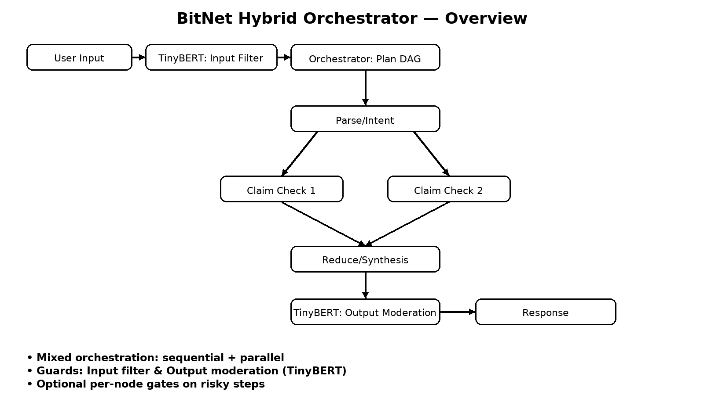

# BitNet Hybrid Orchestrator

_Compact, edge-ready orchestration that blends **hierarchical**, **parallel**, and **sequential** patterns with **BitNet** as the core reasoner and **TinyBERT** as dual-layer safeguards._

<div align="center">

<!-- Goal badge (GitHub-safe, no inline CSS) -->
<a href="#what-is-this">
  
</a>

<br/><br/>

<!-- Row 1: Badges -->
<a href="https://colab.research.google.com/gist/ShiySabiniano/a34e01bcfc227cddc55a6634f1823539/bitnet_tinybert_orchestrator_colab.ipynb">
  
</a>
&nbsp;
<a href="https://ShiySabiniano.github.io/bitnet-hybrid-orchestrator/">
  
</a>
&nbsp;
<a href="https://github.com/ShiySabiniano/bitnet-hybrid-orchestrator/actions">
  
</a>
&nbsp;
<a href="LICENSE">
  
</a>
&nbsp;
<a href="https://img.shields.io/badge/status-alpha-orange">
  
</a>

<br/><br/>

<!-- Row 2: Quick links -->
<a href="https://github.com/ShiySabiniano/bitnet-hybrid-orchestrator"><b>🏠 Repo</b></a>
&nbsp;•&nbsp;
<a href="https://github.com/ShiySabiniano/bitnet-hybrid-orchestrator/issues"><b>🐞 Issues</b></a>
&nbsp;•&nbsp;
<a href="https://github.com/ShiySabiniano/bitnet-hybrid-orchestrator/discussions"><b>💬 Discussions</b></a>
&nbsp;•&nbsp;
<a href="https://github.com/ShiySabiniano/bitnet-hybrid-orchestrator/releases"><b>📦 Releases</b></a>

</div>

> **Status:** alpha • **License:** AGPL-3.0-or-later • **Owner:** **Shiy Sabiniano**

---

## What is this?

A production-minded blueprint and runnable skeleton for a **hybrid orchestration** system:

- **BitNet agents** for summarization, verification, and synthesis (swap in your real BitNet backend).
- **TinyBERT Guard** at **input**, optional **per-node**, and **output** for PII redaction + moderation.
- **Mixed DAG** execution (sequential + parallel) with timeouts, retries, and budget-aware routing.
- **Config-as-data** via `orchestrator/pipeline.yml`.

Designed for **on-device / edge** targets: phones, SBCs, and lean VPS.

---

## Quickstart

- **One-click demo (Colab):**  
  👉 https://colab.research.google.com/gist/ShiySabiniano/a34e01bcfc227cddc55a6634f1823539/bitnet_tinybert_orchestrator_colab.ipynb

- **Docs site (GitHub Pages):**  
  👉 https://ShiySabiniano.github.io/bitnet-hybrid-orchestrator/

> Looking for the detailed steps? See **docs/quickstart.md** (or the docs site).

---

## Local install (core runtime)

```bash
git clone https://github.com/ShiySabiniano/bitnet-hybrid-orchestrator.git
cd bitnet-hybrid-orchestrator

# macOS/Linux
python -m venv .venv && source .venv/bin/activate
# Windows (PowerShell)
# python -m venv .venv; . .\.venv\Scripts\Activate.ps1

pip install -r orchestrator/requirements.txt
````

Run the tiny CLI demo (optional):

```bash
python orchestrator/cli.py --input "Contact test@example.com. BitNet b1.58 ... TinyBERT ..."
# or
python orchestrator/cli.py --input @sample.txt
```

---

## Optional Web UI (Gradio)

You added **`ui/requirements.txt`** to keep UI deps separate. Install and launch a small web UI:

```bash
# after core install
pip install -r ui/requirements.txt
```

**Option A — in Colab (recommended to try first):**
Use the final “Cell 6/6” shown in **docs/colab.md** to launch a shareable Gradio UI.

**Option B — local script:**
Create `ui/gradio_demo.py` by copying the Gradio block from **docs/colab.md (Cell 6/6)**, then:

```bash
python ui/gradio_demo.py
# A local URL and/or a public gradio.live link will appear
```

---

## Architecture at a glance



* **Per-node gates** only where risk warrants (e.g., tool/exec/network nodes).
* **Moderation card** attaches to outputs for auditable traces.

---

## Project layout

```
.
├─ orchestrator/
│  ├─ requirements.txt
│  ├─ pipeline.yml
│  ├─ cli.py
│  └─ (skeleton runtime: scheduler, registry, agents in the notebook)
├─ ui/
│  └─ requirements.txt        # gradio, nest_asyncio (optional UI deps)
├─ docs/
│  ├─ index.md • quickstart.md • architecture.md • safety.md • api.md • roadmap.md • colab.md
│  ├─ _config.yml
│  └─ assets/
│     ├─ logo.svg
│     └─ diagram-overview.png
├─ .github/ISSUE_TEMPLATE/
│  ├─ bug_report.md
│  └─ feature_request.md
├─ SECURITY.md • CODE_OF_CONDUCT.md • CONTRIBUTING.md • COMPLIANCE.md
├─ THIRD_PARTY_LICENSES.md • CHANGELOG.md • LICENSE • README.md
└─ notebooks/
   └─ BitNet_TinyBERT_Orchestrator_Colab.ipynb (link in README/Docs)
```

---

## Compliance & Security

* **License:** AGPL-3.0-or-later — see [LICENSE](LICENSE).
* **Network use (AGPL §13):** expose `/source` or a UI footer + `X-AGPL-Source` header with the running commit.
  Drop-ins in **[COMPLIANCE.md](COMPLIANCE.md)**.
* **Vulnerabilities:** follow **[SECURITY.md](SECURITY.md)** (PGP contact + safe-harbor).
* **PII:** Use dummy data in samples (`test@example.com`, `202-555-0142`); tracing redacts PII by default.

---

## Links

* 📒 Notebook: Colab demo — **one-click run**
  [https://colab.research.google.com/gist/ShiySabiniano/a34e01bcfc227cddc55a6634f1823539/bitnet\_tinybert\_orchestrator\_colab.ipynb](https://colab.research.google.com/gist/ShiySabiniano/a34e01bcfc227cddc55a6634f1823539/bitnet_tinybert_orchestrator_colab.ipynb)
* 🧭 Docs site: [https://ShiySabiniano.github.io/bitnet-hybrid-orchestrator/](https://ShiySabiniano.github.io/bitnet-hybrid-orchestrator/)
* 🐞 Issues: [https://github.com/ShiySabiniano/bitnet-hybrid-orchestrator/issues](https://github.com/ShiySabiniano/bitnet-hybrid-orchestrator/issues)

---

## Owner

**Shiy Sabiniano**

```

Want me to update **docs/quickstart.md** to include the new **Optional Web UI (Gradio)** section and the `ui/requirements.txt` flow? If yes, paste your preferred wording or say “go for it” and I’ll draft it.
::contentReference[oaicite:0]{index=0}
```
