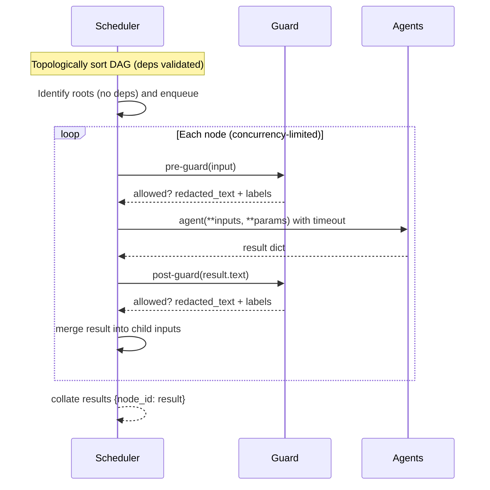
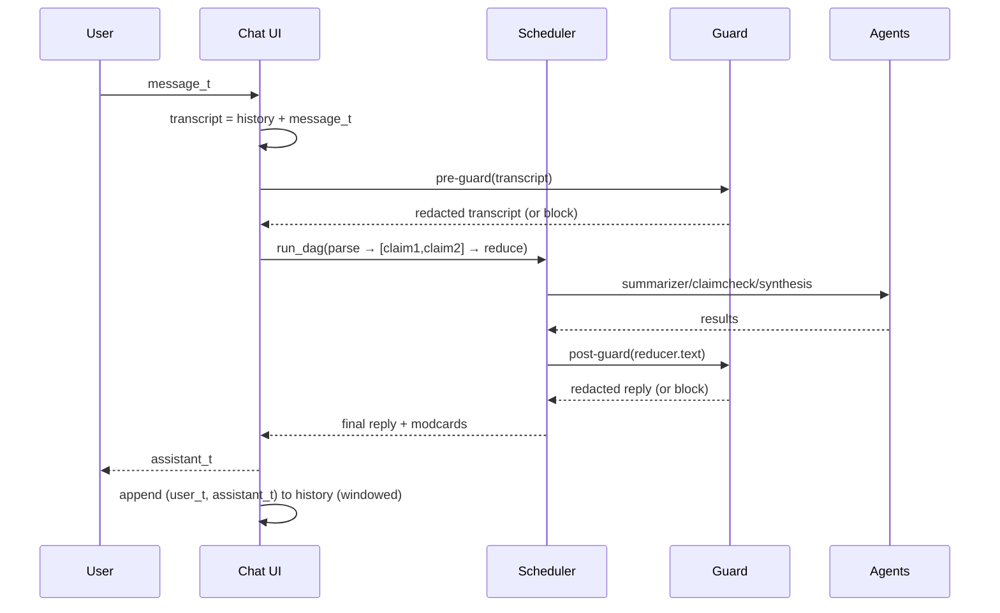

# Architecture

This document explains how the **BitNet Hybrid Orchestrator** is put together: the core runtime (Node/Registry/Scheduler), the **TinyBERT Guard**, placeholder **agents** you can swap for BitNet backends, and the optional **chat mode** that preserves context across turns.

- **Execution model:** hierarchical planning, sequential dependencies, and parallel branches in a single DAG.
- **Safety:** pre-/post-guard on selected nodes, with PII redaction and moderation cards.
- **Config-as-data:** pipelines defined in YAML (`orchestrator/pipeline*.yml`).

---

## High-level flow

```mermaid
flowchart TD
A[User Input] --> G1[ TinyBERT Guard • input ]
G1 -->|redacted text| O[Orchestrator (Scheduler)]
O --> P[Parse/Intent (summarizer)]
P --> C1[Claim Check 1]
P --> C2[Claim Check 2]
C1 --> R[Reduce/Synthesis]
C2 --> R
R --> G2[ TinyBERT Guard • output ]
G2 --> X[Response]
````

* The **Orchestrator** executes a DAG of **Nodes**. Parents feed their outputs into children (shallow merge).
* The **Guard** may be applied at the **pipeline boundary** (input/output) and/or **per-node** (for risky nodes).
* The default demo runs `parse → [claim1, claim2] → reduce`.

---

## Components

### 1) Node (data model)

```python
@dataclass
class Node:
    id: str
    agent: str                # registry key, e.g., "bitnet.summarizer"
    deps: List[str] = []      # upstream node ids
    guard_pre: bool = True    # run guard on input to this node
    guard_post: bool = True   # run guard on output of this node
    timeout_ms: int = 1000
    max_retries: int = 0
    params: Dict[str, Any] = {}
```

* **Inputs** to a node are the **shallow merge** of all parent outputs, plus any top-level `sources`.
* **Params** are merged last and may override keys from inputs when needed.

### 2) Registry (agent lookup)

* A lightweight mapping from name → async function.
* Contract: `async def agent(**kwargs) -> dict` returning **at least** `{"text": "..."}`.
* In the demo:

  * `bitnet.summarizer` (extractive, deterministic)
  * `bitnet.claimcheck` (heuristic overlap + “evidence”)
  * `bitnet.synthesis` (executive brief reducer)

You can swap these for **BitNet** backends without changing the orchestrator.

### 3) Scheduler (DAG executor)

* Validates dependencies and topologically executes nodes.
* Runs ready nodes in parallel under a **concurrency semaphore**.
* Applies:

  * **Pre-guard**: `guard.check(..., mode="input")`
  * **Post-guard**: `guard.check(..., mode="output")`
  * **Timeouts**: per-node `timeout_ms`
  * **Retries**: simple backoff up to `max_retries`
* Produces `{node_id: result_dict}`, where `result_dict` may contain:

  * `text: str` (primary payload)
  * `_moderation: list` (per-guard moderation cards)
  * `_node: str` (node id)
  * `_error: str` (if execution failed)

### 4) Guard (TinyBERT-style)

* Provides **PII redaction** (email/phone via regex) and **moderation** signals.
* Modes:

  * `regex-only` (default; jailbreak heuristics + PII regex)
  * `onnx+regex` (if **TinyBERT ONNX** model + tokenizer are provided)
* Thresholds (defaults shown in code / YAML):

  * `toxicity_block`, `jailbreak_block`, `pii_redact`
* Output: **moderation card** (see schema below) that attaches to node results.

---

## Execution lifecycle



**Error handling**

* If a node fails (timeout/exception/guard block), its entry includes `"_error"`.
* Downstream nodes still receive the partial merge; you can design them to tolerate missing upstreams.
* The Scheduler raises `dag_unresolved_nodes` if cycles or permanent blocks prevent readiness.

---

## Moderation card (schema)

Attached to results under `"_moderation"`:

```json
{
  "node": "parse:post",
  "mode": "output",
  "guard_version": "v0.2",
  "allowed": true,
  "text": "possibly redacted text",
  "labels": {
    "toxicity": 0.02,
    "jailbreak": 0.00,
    "pii": 1.00
  },
  "actions": ["redact"],
  "redactions": [
    {"span": [14, 31], "type": "PII.email"}
  ],
  "why": "ok"
}
```

* **Where**: `"node"` indicates which guard hook created the card (`<node_id>:pre` or `:post`).
* **Actions**: `["redact"]`, `["block"]`, or both.

---

## Config as data (YAML)

### `orchestrator/pipeline.yml` (single-turn)

```yaml
version: 0.1.0
schema: pipeline.v1
name: summarize_and_verify

budgets:
  latency_ms: 1800
  max_concurrency: 2
  memory_mb: 1200

models:
  reasoner: bitnet-s-1.58b
  guard: tinybert-onnx-int8

policies:
  thresholds:
    toxicity_block: 0.5
    pii_redact: 0.7
    jailbreak_block: 0.6

nodes:
  - id: parse
    agent: bitnet.summarizer
    guard_pre: true
    guard_post: true
    params: { max_sentences: 3 }

  - id: claim1
    agent: bitnet.claimcheck
    deps: [parse]
    params: { claim: "C1" }

  - id: claim2
    agent: bitnet.claimcheck
    deps: [parse]
    params: { claim: "C2" }

  - id: reduce
    agent: bitnet.synthesis
    deps: [claim1, claim2]
```

### `orchestrator/pipeline.chat.yml` (chat-mode sample)

```yaml
conversation:
  kind: transcript          # or "none" for single-turn
  window_messages: 12       # how many (user,assistant) pairs to keep
  persist: false            # if you add a server, set true to store
  redact_pii_in_history: true
```

* The UI (Colab/Gradio) concatenates the **rolling transcript** into `sources.text` for the root node.
* The Guard runs on the full transcript (input) and on the synthesized reply (output).

---

## Chat mode (multi-turn)



**State & windowing**

* History is windowed at **N pairs** (configurable) to bound latency/memory.
* If `redact_pii_in_history: true`, the **redacted** transcript is the one persisted.

**Safety**

* Guard runs **every turn** on **input** and **output**.
* If a turn is **blocked**, the UI can surface `why` (`toxicity_block` / `jailbreak_block`) to the user.

See **[docs/chat.md](./chat.md)** for usage and troubleshooting.

---

## Swapping in BitNet backends

Keep agent signatures and route to your runtime:

```python
async def summarizer(text: str, max_sentences: int = 3, **_) -> dict:
    # call your BitNet summarizer here
    return {"text": "..."}
```

* You can add more nodes (e.g., tools, retrieval) and mark them with `guard_pre/guard_post` as needed.
* For **RAG**, replace the toy matching in `claimcheck` with DuckDB + FAISS and pass retrieved chunks through the DAG.

---

## Concurrency, timeouts, retries

* Concurrency is controlled via a **semaphore** (set by `budgets.max_concurrency`).
* Each node runs under a **timeout**; timeouts raise `TimeoutError` and count as an attempt.
* **Retries** apply a short incremental backoff and respect the same timeout each attempt.

---

## Observability (lightweight)

* Each node result includes `_node`, optional `_error`, and optional `_moderation`.
* You can serialize the final `{node_id: result}` map and attach it to reports or logs (be mindful of PII—prefer **redacted** fields).

---

## Security & compliance

* **PII**: guard redacts emails/phones by default. Use dummy PII in examples.
* **AGPL §13** (if hosted): show a **Source** link to the running commit, include an `X-AGPL-Source` header, and expose `/source`. See **[COMPLIANCE.md](../COMPLIANCE.md)**.
* **PGP**: maintainer key at `security/pgp/ShiySabiniano.asc`. Reporting workflow in **[SECURITY.md](../SECURITY.md)**.

---

## References

* **Quickstart:** [docs/quickstart.md](./quickstart.md)
* **Colab Guide:** [docs/colab.md](./colab.md)
* **Chat Mode:** [docs/chat.md](./chat.md)
* **Pipeline API:** [docs/api.md](./api.md)

```
::contentReference[oaicite:0]{index=0}
```
